# Polymarket Arbitrage Trading Bot

**Yüksek performanslı, asenkron Python trading botu** - Polymarket binary option piyasalarında istatistiksel arbitraj fırsatlarını yakalar.

## 📋 İçindekiler

- [Özellikler](#-özellikler)
- [Nasıl Çalışır?](#-nasıl-çalışır)
- [Kurulum](#-kurulum)
- [Yapılandırma](#-yapılandırma)
- [Kullanım](#-kullanım)
- [Market ID Bulma](#-market-id-bulma)
- [Mimari](#-mimari)
- [Risk Uyarıları](#-risk-uyarıları)
- [Sorun Giderme](#-sorun-giderme)
- [Lisans](#-lisans)

## 🎯 Özellikler

- ✅ **Asenkron Mimari**: `asyncio` + `aiohttp` ile yüksek performans
- ✅ **Real-time Monitoring**: WebSocket üzerinden düşük latency orderbook güncellemeleri
- ✅ **Tag-based Market Discovery**: Crypto, Politics gibi kategorilerdeki tüm marketleri otomatik tara
- ✅ **Parallel Order Execution**: YES ve NO order'larını aynı anda gönder
- ✅ **Rate Limiting**: Polymarket API limitlerini otomatik yönet
- ✅ **Balance Checking**: Her trade öncesi USDC balance kontrolü
- ✅ **Structured Logging**: Detaylı log kayıtları ile debugging
- ✅ **Graceful Shutdown**: CTRL+C ile güvenli kapatma

## 💡 Nasıl Çalışır?

### Arbitraj Mantığı

Binary option'larda **YES + NO fiyatları toplamı her zaman 1.00 olmalı** çünkü biri kazanınca diğeri kaybeder. Ancak bazen piyasa inefficiency nedeniyle toplam 1.00'ın altında olabilir:

```
Örnek:
YES fiyatı: $0.47
NO fiyatı: $0.49
Toplam: $0.96 < $1.00 ❌

Arbitraj:
1. Her ikisini de satın al: $0.96 harcarsın
2. Market resolve olunca: $1.00 kazanırsın (kazanan token)
3. Kar: $1.00 - $0.96 = $0.04 (4% kar, risk-free!)
```

### Bot Stratejisi

1. **Market Taraması**: Belirlediğiniz tag'lerdeki tüm aktif marketleri fetch et
2. **WebSocket Monitoring**: Real-time orderbook güncellemelerini dinle
3. **Arbitraj Tespiti**: Her güncelleme geldiğinde YES + NO toplamını kontrol et
4. **Threshold Check**: Toplam < 0.98 ise fırsat var!
5. **Balance Check**: Yeterli USDC var mı?
6. **Parallel Execution**: YES ve NO order'larını FOK (Fill-Or-Kill) ile gönder
7. **Position Tracking**: Her iki order da dolarsa → başarılı arbitraj!

## 🚀 Kurulum

### 1. Gereksinimler

- Python 3.10 veya üzeri
- Polymarket hesabı
- Polygon wallet (private key)
- USDC balance (Polygon ağında)

### 2. Bağımlılıkları Yükle

```bash
pip install -r requirements.txt
```

### 3. Yapılandırma Dosyası Oluştur

```bash
# Windows
copy env_template.txt .env

# Linux/Mac
cp env_template.txt .env
```

## ⚙️ Yapılandırma

`.env` dosyasını düzenleyin:

### Zorunlu Ayarlar

```env
# Wallet Configuration
POLY_PRIVATE_KEY=your_private_key_here
POLY_PROXY_ADDRESS=your_proxy_address_here
POLY_SIGNATURE_TYPE=1  # 0=EOA, 1=Email/Magic, 2=Browser Wallet
```

#### Private Key Nasıl Bulunur?

**Email/Magic Login Kullanıyorsanız:**
1. https://reveal.magic.link/polymarket adresine gidin
2. Polymarket'te kullandığınız email ile giriş yapın
3. Private key'inizi kopyalayın

**MetaMask/Wallet Extension Kullanıyorsanız:**
1. Wallet extension'ınızı açın
2. Settings → Security → Reveal Private Key
3. Şifrenizi girin ve private key'i kopyalayın

#### Proxy Address Nasıl Bulunur?

1. Polymarket.com'a giriş yapın
2. Sağ üstteki profil fotoğrafınızın altında bir adres göreceksiniz
3. Bu adresi `POLY_PROXY_ADDRESS` olarak kullanın

**Not:** EOA (signature_type=0) kullanıyorsanız proxy address gerekmez.

### Opsiyonel Ayarlar

```env
# Trading Parameters
TRIGGER_THRESHOLD=0.98        # YES + NO < 0.98 ise trade yap
FIXED_INVESTMENT_AMOUNT=50.0  # Her arbitraj için $50 yatır
MIN_PROFIT_THRESHOLD=0.02     # Minimum %2 kar şartı
MIN_USDC_BALANCE=100.0        # Balance < $100 ise durdur

# Market Selection
TARGET_TAGS=crypto,politics   # Hangi kategorileri izle?
MIN_MARKET_VOLUME=1000.0      # Minimum $1k hacim şartı
MIN_LIQUIDITY=500.0           # Minimum $500 likidite şartı

# Rate Limiting
MAX_API_CALLS_PER_MINUTE=80   # API rate limit (max 100)
MAX_WS_SUBSCRIPTIONS=50       # Aynı anda kaç market izle?
```

## 📊 Kullanım

### Bot'u Başlat

```bash
python bot.py
```

### Beklenen Çıktı

```
2025-12-29 15:30:00.123 | INFO     | ============================================================
2025-12-29 15:30:00.124 | INFO     | POLYMARKET ARBITRAGE BOT CONFIGURATION
2025-12-29 15:30:00.125 | INFO     | ============================================================
2025-12-29 15:30:00.126 | INFO     | Signature Type: Polymarket Proxy (Email/Magic)
2025-12-29 15:30:00.127 | INFO     | Trigger Threshold: 0.98 (YES + NO < 0.98)
2025-12-29 15:30:00.128 | INFO     | Investment Amount: $50.00 per trade
2025-12-29 15:30:00.129 | INFO     | Target Tags: crypto, politics
2025-12-29 15:30:00.130 | INFO     | ============================================================
2025-12-29 15:30:01.456 | SUCCESS  | ✓ All components initialized successfully!
2025-12-29 15:30:02.789 | SUCCESS  | Fetched 47 markets to monitor
2025-12-29 15:30:03.123 | SUCCESS  | ============================================================
2025-12-29 15:30:03.124 | SUCCESS  | BOT IS NOW RUNNING - Monitoring for arbitrage opportunities
2025-12-29 15:30:03.125 | SUCCESS  | ============================================================
```

### Arbitraj Fırsatı Bulunduğunda

```
2025-12-29 15:35:42.567 | SUCCESS  | 🎯 ARBITRAGE OPPORTUNITY DETECTED!
  Market: Will BTC hit $100k by Dec 31, 2025?
  YES Price: $0.4700 | NO Price: $0.4900
  Implied Sum: 0.9600 (Threshold: 0.98)
  Expected Profit: 4.17%
  Investment: $50.00 (YES: $24.48, NO: $25.52)
  Position Size: 52.09 YES + 52.08 NO tokens

2025-12-29 15:35:42.789 | INFO     | 💰 Executing arbitrage trade...
2025-12-29 15:35:43.234 | SUCCESS  | ✅ Arbitrage executed successfully! Execution time: 445.23ms
```

### Bot'u Durdur

**CTRL + C** tuşlarına basın. Bot güvenli bir şekilde kapanacak ve istatistikleri gösterecektir.

## 🔍 Market ID Bulma

### Yöntem 1: URL'den Manuel Bulma

1. Polymarket.com'da bir market açın:
   ```
   https://polymarket.com/event/bitcoin-100k-by-2025
   ```

2. Slug'ı URL'den kopyalayın: `bitcoin-100k-by-2025`

3. Gamma API'yi sorgula:
   ```bash
   curl "https://gamma-api.polymarket.com/events/slug/bitcoin-100k-by-2025"
   ```

4. Response'dan `condition_id` ve `tokens` bilgisini al.

### Yöntem 2: Otomatik Tag-based (Bot'un Kullandığı)

Bot, belirlediğiniz `TARGET_TAGS` kategorilerindeki tüm marketleri otomatik olarak bulur:

```python
# Bot başlarken
markets = await market_manager.fetch_all_target_markets()
# → Crypto ve Politics kategorilerindeki 50+ market
```

### Desteklenen Tag'ler

- `crypto` - Kripto piyasaları (BTC, ETH, etc.)
- `politics` - Politik tahminler
- `sports` - Spor bahisleri
- `pop-culture` - Pop kültür
- `business` - İş dünyası

## 🏗️ Mimari

```
bot.py                    # Ana orchestration
├── config.py             # Yapılandırma yönetimi
├── logger.py             # Structured logging
├── rate_limiter.py       # API rate limiting
├── market_manager.py     # Gamma API → market fetching
├── websocket_manager.py  # CLOB WebSocket → real-time data
├── arbitrage_engine.py   # Fırsat tespiti ve hesaplama
├── balance_checker.py    # Polygon USDC balance query
├── clob_client_wrapper.py # py-clob-client wrapper
├── order_executor.py     # Parallel order execution
└── transaction_decoder.py # CTF Exchange tx monitoring (opsiyonel)
```

### Veri Akışı

```mermaid
graph LR
    A[Gamma API] -->|Markets| B[Market Manager]
    B -->|Subscribe| C[WebSocket Manager]
    C -->|Orderbook Updates| D[Arbitrage Engine]
    D -->|Opportunity Found| E[Balance Checker]
    E -->|Balance OK| F[Order Executor]
    F -->|Parallel Orders| G[CLOB API]
    G -->|Settlement| H[CTF Exchange]
```



## ⚠️ Risk Uyarıları

### 1. Partial Fill Risk (En Kritik!)

**Problem:** YES order doldu ama NO dolmadı → Asimetrik pozisyon

**Çözüm:** 
- Bot FOK (Fill-Or-Kill) order kullanır → Ya her ikisi dolar, ya hiçbiri
- Yine de nadir durumlarda partial fill olabilir
- Logları kontrol edin: `⚠️ PARTIAL FILL DETECTED!`

### 2. Latency Risk

**Problem:** Rust botlar daha hızlı, sen geç kalabilirsin

**Çözüm:**
- WebSocket kullan (REST API değil) → ~200-500ms latency
- VPS kullan (Polygon'a yakın sunucu)
- Bu bot HFT için değil, "güvenli" fırsatlar için tasarlandı

### 3. Slippage

**Problem:** Order gönderdiğin anda fiyat değişebilir

**Çözüm:**
- `TRIGGER_THRESHOLD=0.98` → 2% safety margin
- Market order değil, limit order kullan

### 4. Gas Volatility

**Problem:** CLOB API kullandığımız için biz gas ödemiyoruz ama operator gecikebilir

**Çözüm:** FOK order → Anında dolarsa dolar, dolmazsa iptal

### 5. Balance Management

**Problem:** USDC biterse bot duracak

**Çözüm:**
- `MIN_USDC_BALANCE=100.0` → Bakiye < $100 ise durdur
- Düzenli balance kontrolü yap

## 🐛 Sorun Giderme

### "POLY_PRIVATE_KEY is required"

**Sebep:** `.env` dosyası yok veya private key girilmemiş

**Çözüm:**
```bash
cp env_template.txt .env
# Sonra .env'yi düzenle ve private key'i ekle
```

### "Failed to connect to Polygon RPC"

**Sebep:** RPC endpoint yanıt vermiyor

**Çözüm:**
```env
# .env dosyasında farklı RPC dene:
POLYGON_RPC_URL=https://polygon-rpc.com/
# veya
POLYGON_RPC_URL=https://rpc-mainnet.matic.network/
# veya Alchemy/Infura API key'i kullan
```

### "Insufficient USDC balance"

**Sebep:** Wallet'ında yeterli USDC yok (Polygon ağında)

**Çözüm:**
1. Polygon USDC al (örn: bridge from Ethereum)
2. Veya `FIXED_INVESTMENT_AMOUNT` değerini düşür (örn: 10.0)

### "Not enough balance / allowance"

**Sebep:** CTF Exchange contract'ına USDC allowance verilmemiş

**Çözüm:**
- Polymarket web sitesinde bir trade yap (allowance otomatik ayarlanır)
- Veya manuel approve: https://polygonscan.com/address/0x2791Bca1f2de4661ED88A30C99A7a9449Aa84174#writeContract

### "WebSocket connection closed"

**Sebep:** Internet bağlantısı kesildi veya timeout

**Çözüm:**
- Bot otomatik reconnect yapar (exponential backoff ile)
- Log'lara bak: `Reconnecting in 5s...`
- Eğer sürekli disconnect oluyorsa internet bağlantını kontrol et

### "No arbitrage opportunities found"

**Sebep:** Bu normal! Arbitraj fırsatları nadir

**Çözüm:**
- Sabırlı ol, günde 10-20 fırsat bekleniyor
- `TRIGGER_THRESHOLD` değerini artır (örn: 0.99) → Daha fazla fırsat ama daha az kar
- `TARGET_TAGS` ekle (daha fazla market → daha fazla fırsat)

## 📈 Beklenen Performans

- **Latency**: WebSocket event → Order submission: ~200-500ms
- **Fırsat Sayısı**: Crypto/Politics kategorilerinde günde ~10-20 fırsat
- **Kar Oranı**: %2-5 per trade (0.98 threshold ile)
- **Günlük Hedef**: 3-4 başarılı trade × %3 kar × $50 = **~$50-100 profit**

## 📝 Log Dosyaları

Loglar `logs/` klasöründe saklanır:

```
logs/
└── arbitrage_2025-12-29.log  # Günlük log dosyası
```

### Log Seviyeleri

- `DEBUG`: Tüm detaylar (orderbook updates, etc.)
- `INFO`: Genel bilgiler (market fetching, etc.)
- `SUCCESS`: Başarılı işlemler
- `WARNING`: Uyarılar (düşük balance, etc.)
- `ERROR`: Hatalar (failed orders, etc.)

Log seviyesini `.env` dosyasından ayarla:

```env
LOG_LEVEL=INFO  # veya DEBUG, WARNING, ERROR
```

## 🧪 Test Etme

Her modül bağımsız test edilebilir:

```bash
# Config test
python config.py

# Balance checker test
python balance_checker.py

# Market manager test
python market_manager.py

# WebSocket manager test
python websocket_manager.py

# Arbitrage engine test
python arbitrage_engine.py
```

## 🔐 Güvenlik

- ✅ Private key **sadece** `.env` dosyasında (ASLA git'e commit etme!)
- ✅ `.gitignore` ile `.env` otomatik ignore edilir
- ✅ API credentials ephemeral (her session yeni)
- ✅ Non-custodial trading (operator fund'larını kontrol etmez)
- ✅ HTTPS + WSS encrypted connections

## 📚 Kaynaklar

- [Polymarket CLOB API Docs](https://docs.polymarket.com/)
- [py-clob-client GitHub](https://github.com/Polymarket/py-clob-client)
- [Gnosis CTF Framework](https://docs.gnosis.io/conditionaltokens/)
- [Polygon Network](https://polygon.technology/)

## 🤝 Katkıda Bulunma

Bu bir eğitim amaçlı projedir. Kendi risk yönetiminiz altında kullanın.

## ⚖️ Lisans

MIT License - Detaylar için LICENSE dosyasına bakın.

## 🙏 Teşekkürler

- Polymarket ekibine resmi client library için
- Gnosis ekibine CTF framework için

---

**Uyarı:** Bu bot gerçek para ile trading yapar. Kullanmadan önce mantığı anlayın ve küçük miktarlarla test edin. Yatırım tavsiyesi değildir.

**Son Güncelleme:** Aralık 2025


